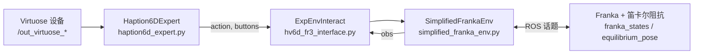

# `scripits` 三脚本关系说明

本文说明 `dated_reference/scripits/` 下三个 Python 脚本的职责、数据流与在原先 ROS 包中的组合方式。目录名 `scripits` 为历史拼写，与常见 `scripts` 同义。

## 总览

三者构成一条 **「Virtuose 6D 专家输入 → 笛卡尔阻抗目标位姿 → Franka 状态反馈」** 的闭环遥操作管线：

| 文件 | 核心类型 | 角色 |
|------|-----------|------|
| `haption6d_expert.py` | `Haption6DExpert` | **Agent（专家策略）**：订阅 Haption/Virtuose 位姿与按键，在「拖拽」模式下输出 6D 增量动作与按钮状态。 |
| `simplified_franka_env.py` | `SimplifiedFrankaEnv` | **Env（环境与执行）**：订阅 Franka 状态、发布阻抗控制器平衡位姿；提供类 Gym 的 `reset` / `step` 与 retarget 逻辑。 |
| `hv6d_fr3_interface.py` | `ExpEnvInteract` | **编排节点**：以固定频率调用 `agent.get_action` → `env.step`，串联上下层。 |

逻辑关系可概括为：



## 1. `haption6d_expert.py` — 专家输入（6D 残差 / 差分映射）

- **依赖**：`rospy`、`scipy.spatial.transform.Rotation`、自定义消息包 `exp_env_interact.msg`（`out_virtuose_pose`、`out_virtuose_status`）。
- **订阅话题**（硬编码）：
  - `/out_virtuose_pose`：`out_virtuose_pose`，更新手持设备位姿 `[x,y,z,qx,qy,qz,qw]`。
  - `/out_virtuose_status`：`out_virtuose_status`，解析按键位掩码得到三键布尔状态。
- **状态机**：
  - `idle`：持续将「当前」与「上一帧」位姿对齐到最新采样，**动作为零**（不输出拖拽增量）。
  - `project_diff`：**按住按钮 2** 进入；释放按钮 2 回到 `idle`。在此状态下根据相邻两帧 Virtuose 位姿计算 **空间系平移差分** 与 **绕上一帧姿态表达的旋转向量差分**，拼成 6 维 `action`。
- **对外接口**：
  - `get_action(obs=None)`：`obs` 在实现中未使用；返回 `(action, [button1])`，供下游区分按键 1 等用途。
  - `cleanup()`：注销订阅。

设计意图（见文件头注释）：**Haption 6D 残差映射拖拽**，即只在用户明确「进入拖拽模式」时把设备微小运动映射为机器人笛卡尔增量。

## 2. `simplified_franka_env.py` — 简化 Franka 环境与 retarget

- **依赖**：`rospy`、`scipy`、`geometry_msgs/PoseStamped`、`franka_msgs/FrankaState`。
- **订阅**：`franka_state_controller/franka_states`（`FrankaState`），用 `O_T_EE` 更新末端位姿估计，用 `K_F_ext_hat_K` 更新 6 维外力/力矩观测。
- **发布**：`/cartesian_impedance_example_controller/equilibrium_pose`（`PoseStamped`），`frame_id` 为 `panda_link0`，作为笛卡尔阻抗控制器的平衡位姿目标。
- **类 Gym 接口**：
  - `reset()`：将目标位姿设为当前估计位姿并发布一次，返回观测。
  - `step(action, buttons)`：内部调用 `retarget(action, buttons)`，再发布目标位姿；当前实现中 `reward` 恒为 `0.0`，`done` 恒为 `False`（可扩展）。
- **观测**：长度 13 的向量——位置(3) + 四元数(4) + 力/力矩(6)。`ExpEnvInteract` 的日志中使用了 `obs[10:13]` 作为力相关显示，与上述布局一致。

`retarget` 将专家给出的 6D 增量累加到 **上一时刻目标位姿**（而非仅当前实测位姿），平移直接加在世界系增量上；旋转将 `action[3:6]` 视作在 **上一目标姿态本体坐标系** 下的旋转向量，再左乘到上一目标姿态上，得到新的目标姿态。

## 3. `hv6d_fr3_interface.py` — 上下层统一接口节点

- **ROS 节点名**：`exp_env_interact_node`（在 `ExpEnvInteract.__init__` 中 `rospy.init_node`）。
- **组合关系**：
  - `self.agent = Haption6DExpert(debug=True)`
  - `self.env = SimplifiedFrankaEnv(debug=True)`
  - 启动时 `self.obs = self.env.reset()`。
- **主循环**（`run`）：在 `while not rospy.is_shutdown()` 中反复调用 `timer_callback()`，每次之后 `self.rate.sleep()`。`rospy.Rate(1000)` 表示目标 **1000 Hz**（注释中仍写有「10Hz / 500Hz」等历史字样，以代码为准）。
- **单步逻辑**：
  1. `action, buttons = self.agent.get_action(self.obs)`（当前实现里专家侧未真正消费 `obs`）。
  2. `self.obs, reward, done, info = self.env.step(action, buttons)`。
  3. 若 `done` 为真则 `reset` 并清零步数（当前 `SimplifiedFrankaEnv` 几乎不会触发）。

文件头注释称其为 **「上下互动统一接口」**：即把「遥操作输入专家」与「Franka 环境封装」固定在同一节点内联跑。

## 4. 独立抽出后的引用路径问题

当前仓库中三文件位于同一目录 `dated_reference/scripits/`，但 `hv6d_fr3_interface.py` 中导入为：

```python
from haption6d_expert import Haption6DExpert
from teleop_infer_infra.scripts.simplified_franka_env import SimplifiedFrankaEnv
```

- `haption6d_expert`：在将 `scripits` 加入 `PYTHONPATH` 或与包同层级运行时通常可用。
- `teleop_infer_infra.scripts.simplified_franka_env`：对应 **原 ROS 包** `teleop_infer_infra` 内的模块路径；单独拷贝 `simplified_franka_env.py` 后，该导入 **会失效**，除非安装同名包或改为例如 `from simplified_franka_env import SimplifiedFrankaEnv`（并保证搜索路径包含本目录）。

`haption6d_expert.py` 依赖的 `exp_env_interact.msg` 同样来自原工作空间中的消息包，单独运行前需编译并 `source` 对应工作空间。

## 5. ROS 话题一览（便于联调）

| 方向 | 话题名 | 消息类型 | 使用者 |
|------|--------|----------|--------|
| 入 | `/out_virtuose_pose` | `exp_env_interact/out_virtuose_pose` | `Haption6DExpert` |
| 入 | `/out_virtuose_status` | `exp_env_interact/out_virtuose_status` | `Haption6DExpert` |
| 入 | `franka_state_controller/franka_states` | `franka_msgs/FrankaState` | `SimplifiedFrankaEnv` |
| 出 | `/cartesian_impedance_example_controller/equilibrium_pose` | `geometry_msgs/PoseStamped` | `SimplifiedFrankaEnv` |

## 6. 小结

- **专家层**（`Haption6DExpert`）只负责从 Virtuose 读入人机接口数据并生成 6D 增量与按钮信息。
- **环境层**（`SimplifiedFrankaEnv`）只负责 Franka 状态估计、目标位姿积分与发布、观测拼装。
- **接口层**（`ExpEnvInteract`）负责 ROS 节点生命周期与高频率 **agent–env** 步进，是原 ROS 包中把两者粘在一起的 **核心节点**。

将三者移出原包时，除 Python 路径外，还需保证 **Virtuose 驱动话题**、**自定义消息**、**Franka 控制器话题名** 与现场 launch 配置一致。
